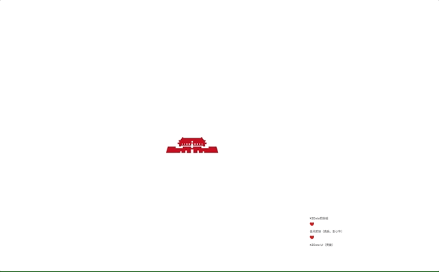
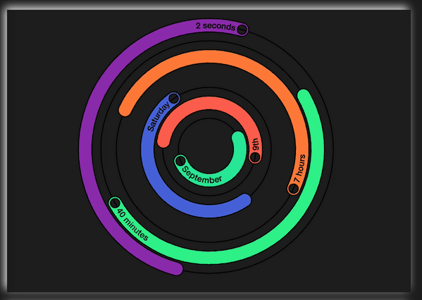
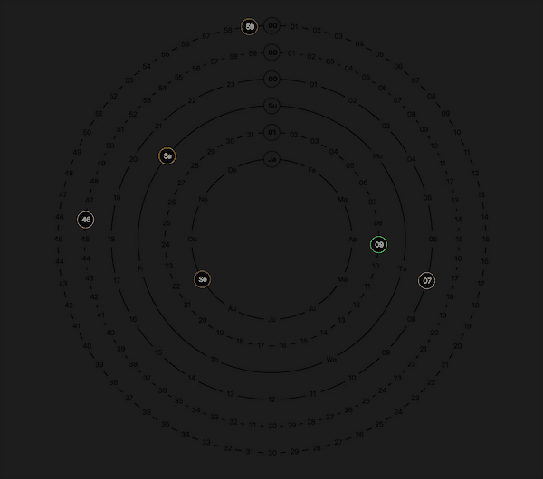

# svg-react-playground

## Get started
Install dependencies and check to see it works. It is recommended that you use [Yarn](https://yarnpkg.com/) for deterministic installs, but `npm install` will work just as well.
```bash
$ yarn install    # Install project dependencies
$ yarn start      # Compile and launch (same as `npm start`)
```

## 预览

### 1. K2data技能图


### 2. K2data logo墙


### 3. K2data Logo


### 4. K2data&K2Sigma


### 5. 404 Page Not Found
[](https://postimg.org/image/61vaprsm1/)

### 6. ColorClock


learn from [Mike Bostock](https://bl.ocks.org/mbostock/b89c89ec6b58435956a1)

### 7. ColorClock2


inspired by [Polar Clock III](https://bl.ocks.org/mbostock/c150b717e18d387e1b98)
## Todos
- [ ] wheels
- [ ] ray wheel
- [ ] Alphabet: ~~A~~ ~~B~~ C ~~D~~ E F G H I J ~~K~~ ~~L~~ M N O P **Q** R S ~~T~~ U V W X ~~Y~~ Z
- [x] Canvas iiBD
- [x] SVGLineAnimation
